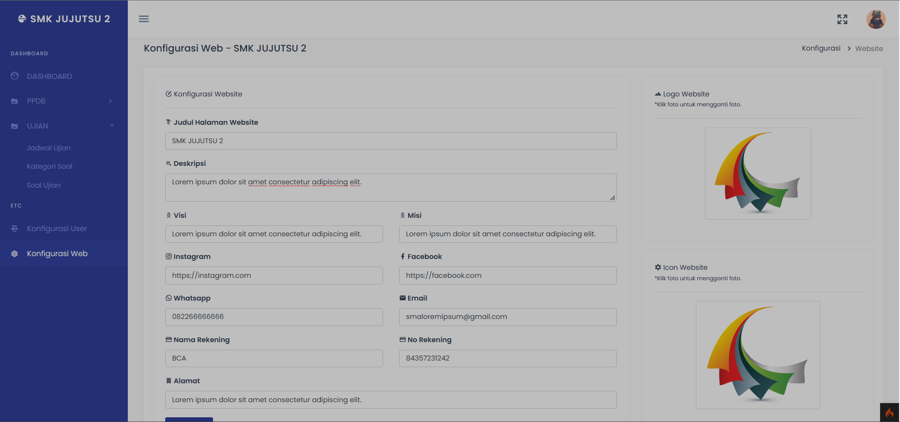
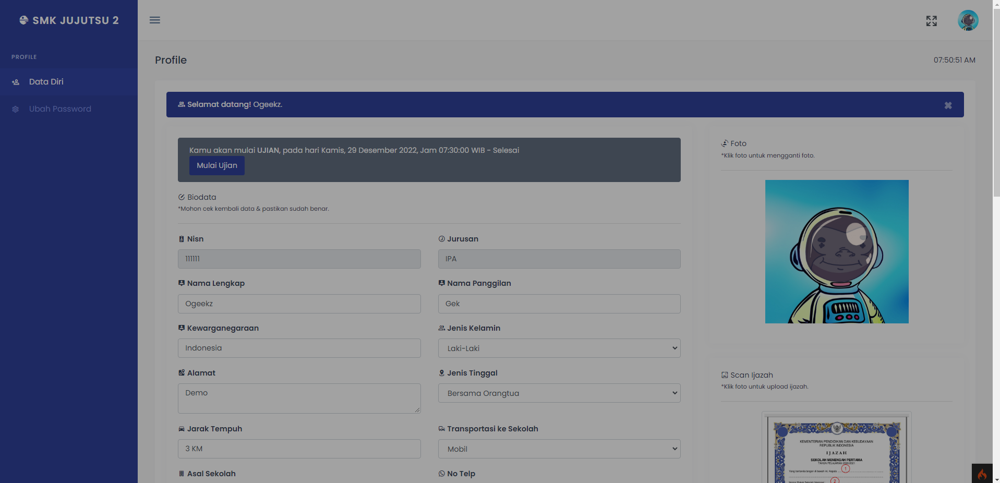
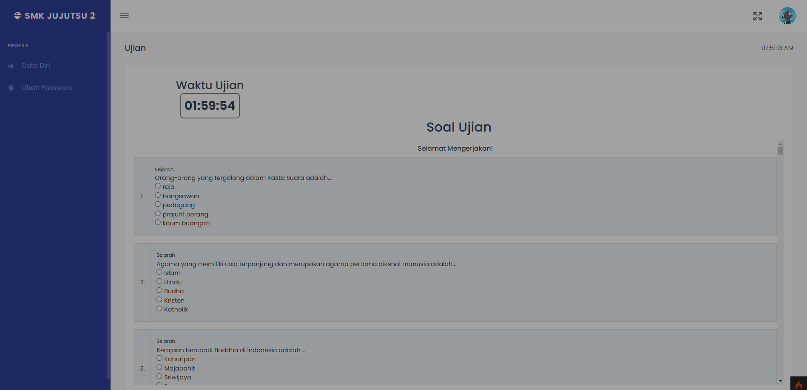

<h1 style="color:blue">PPDB Sekolah</h1>

## Admin



## Profile



## Ujian



## Login Admin

- Username: admin
- Password: admin

**Login Admin** `localhost:8080/login`

**Siswa** `localhost:8080/ppdb`

---

## Cara Install
1. **Clone Repo**

```
git clone https://github.com/prayogimhd/ppdb-ci4.git
```
2. **Buka** Folder `cd ppdb-ci4`
3. **Buat Database** dan import `database.sql`
4. **Set up `.env`**

```bash
database.default.hostname = localhost
database.default.database = nama_database
database.default.username = root
database.default.password = 
database.default.DBDriver = MySQLi
```    
5. **Jalankan perintah**

```bash
php spark serve
```   
6. **Server Berjalan** `localhost:8080`

<p style="color:yellow">Jangan lupa bintangnya ⭐<p>
